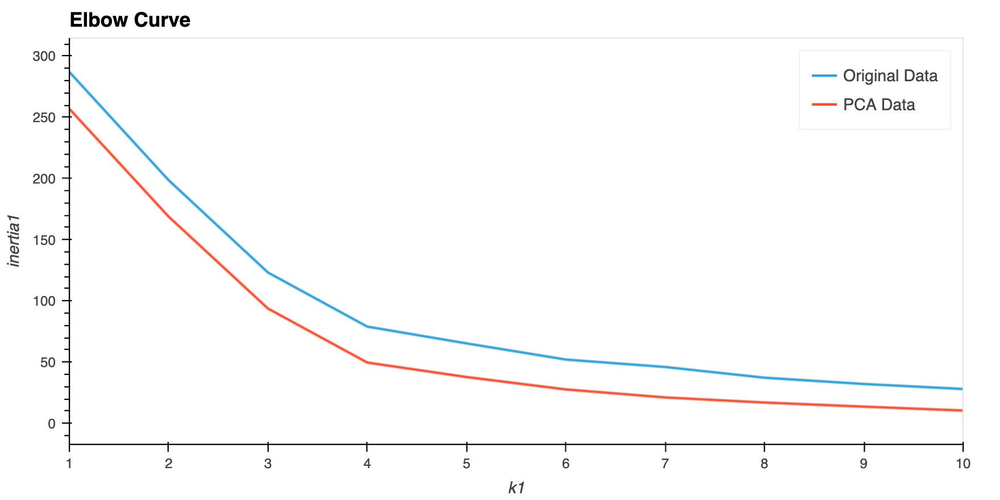
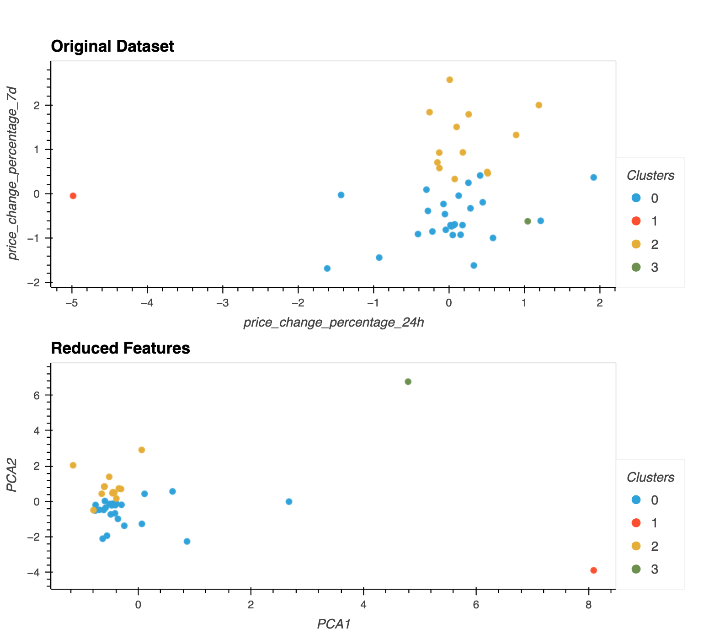

# CryptoClustering

## Table of Contents
- [About](#about)
- [Key Steps](#key-steps)
- [Analysis](#analysis)

## About
Used Python and unsupervised machine learning to categorize and group cryptocurrencies that exhibit similar historical price change patterns.

## Key Steps
1. Prepared the data. Used StandardScalar for data normalization.
2. Found the Best Value for k Using the Original Scaled DataFrame.
3. Clustered Cryptocurrencies with K-means Using the Original Scaled Data.
4. Optimized Clusters with Principal Component Analysis.
5. Found the Best Value for k Using the PCA Data
6. Cluster Cryptocurrencies with K-means Using the PCA Data

## Analysis
What is the best value for k?  
In both data sets 4 is the best k value.

What is the impact of using fewer features to cluster the data using K-Means?  
The following observations are made for the clusters using reduced features: 
- All clusters are more defined. 
- Clusters 0 and 2 are packed together more tightly. 
- Clusters 1 and 3 are a further distance away from Clusters 0,2 compared with the original data that had more features.

   
